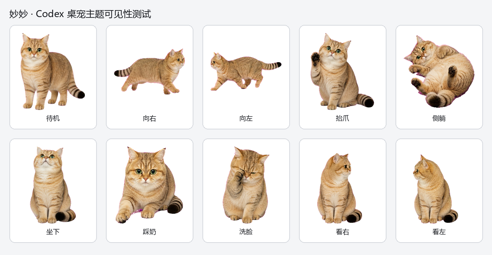
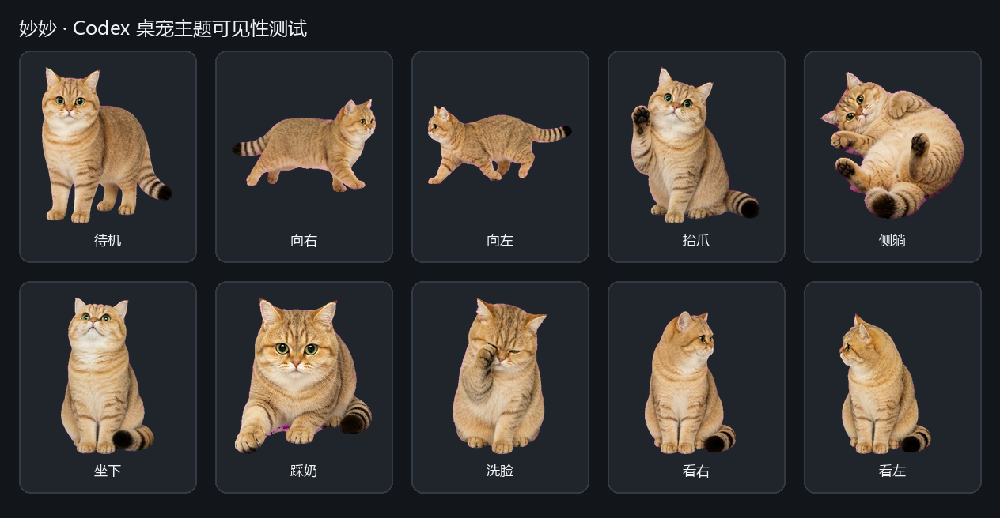

# 妙妙：Codex 半写实金渐层桌宠

“妙妙”是基于本地照片和视频制作的 Codex v2 自定义桌宠。她保留圆脸、绿色圆眼、粉色鼻头、暖金底色与黑色毛尖、浅色下巴胸腹，以及蓬松环纹黑尾尖等真实特征；风格约为 85% 写实、15% 桌宠化简化。





## 已实现

- 待机站立：呼吸、眨眼、耳朵轻转、尾巴轻摆
- 向右与向左轻快小跑
- 坐下等待
- 抬头并抬一只前爪，保留黑色肉垫
- 自然小跳（Codex 标准状态）
- 侧躺、轻露肚的撒娇式短循环
- 交替踩奶
- 抬头审视、歪头和短擦脸
- 16 个顺时针视线方向
- 透明背景、完全静音

## 简化或未独立启用

- 小跑采用“轻快快走 / 小跑”折中，避免高频腿部错位。
- 洗脸缩短为 `review` 状态中的一次擦脸。
- 打滚缩短为侧躺、露肚和轻翻身，不做多圈滚动。
- Codex v2 运行时只有固定状态行，不能直接触发任意动作名称；趴下恢复和完整伸懒腰没有单独状态位，因此未写入无效配置。

完整映射见 [动作与 Codex 状态映射](docs/动作与状态映射.md)。

## 安装

### Windows

下载或克隆仓库，在仓库根目录运行：

```powershell
.\install.ps1
```

也可以把 `pet/miaomiao` 手动复制到：

```text
%USERPROFILE%\.codex\pets\miaomiao
```

打开 Codex 的“设置 → 宠物”，先点击右上角刷新按钮，再选择“妙妙”。

如果文件已经位于上述目录，但 Windows 版 Codex 使用 WSL 后台时仍不显示：

1. 从系统托盘完全退出 Codex；
2. 双击仓库根目录的 `launch-codex-miaomiao.cmd`；
3. 回到“设置 → 宠物”，点击右上角刷新并选择“妙妙”。

该启动器只为当前 Codex 的 Windows/WSL 路径兼容问题设置本次进程环境，不修改系统级环境变量。

macOS / Linux 可运行：

```bash
./install.sh
```

更详细的排查步骤见 [安装与启用](docs/安装与启用.md)。

## 关键文件

```text
pet/miaomiao/
  pet.json              Codex v2 配置
  spritesheet.webp      8×11 最终透明动画图集

previews/
  contact-sheet.png     全部动作接触表
  look-directions.png   16 方向检查表
  theme-light.png       浅色主题可见性测试
  theme-dark.png        深色主题可见性测试
  actions/*.gif         9 个标准状态动图
```

`spritesheet.webp` 为 `1536×2288`、单格 `192×208`，`pet.json` 使用 `spriteVersionNumber: 2`。

## 项目结构

```text
references/photos/      妙妙原始身份照片
references/videos/      本地原始视频（默认不提交公开仓库）
assets/video-keyframes/ 视频关键帧和接触表
assets/hatch-run/       可审计的构建、验证与 QA 记录
docs/                   角色、动作、网络参考、安装与验证文档
pet/miaomiao/           可直接安装的最终宠物
previews/               预览图和动作 GIF
scripts/                抽帧、预览和清单辅助脚本
launch-codex-miaomiao.* Windows/WSL 路径兼容启动器
```

公开仓库不提交原始视频，只提交精选关键帧、最终素材、文档和脚本，以控制体积并保护原始素材。

## 角色与参考

- [妙妙角色身份规范](docs/角色设定.md)
- [动作与状态映射](docs/动作与状态映射.md)
- [网络动作参考与使用边界](docs/网络动作参考.md)
- [构建与验证记录](docs/构建与验证.md)

网络资料只用于学习动作规律，从未用于决定妙妙的外观，也没有把网络视频打包进仓库。
