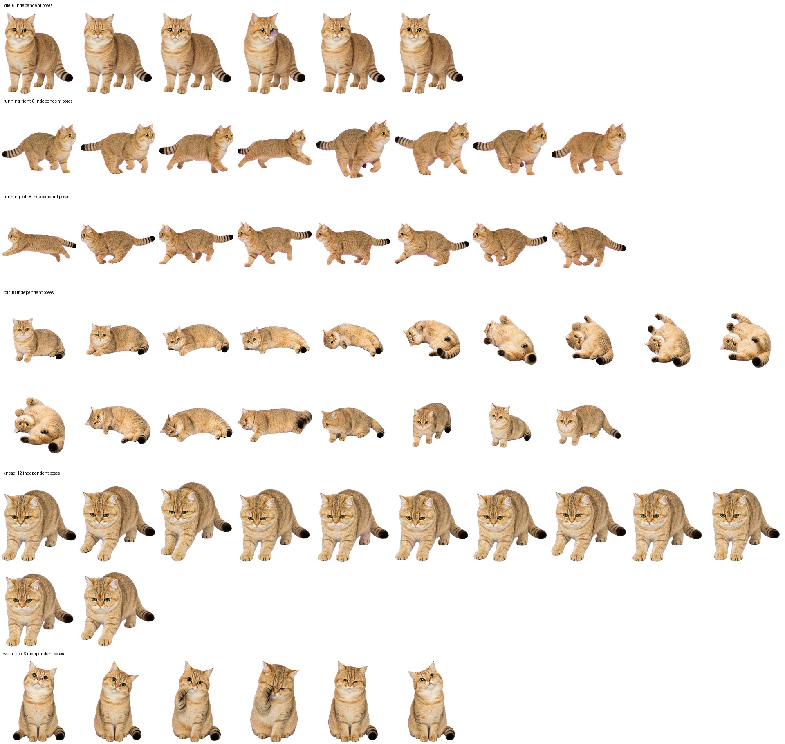

# 妙妙：Windows / macOS 透明桌宠

妙妙使用仓库里的真实照片和动作参考制作。Windows 与 macOS 运行层共用同一套动画和行为配置：

- `pet/miaomiao/actions/`：逐帧 PNG；
- `pet/miaomiao/behavior.json`：动作帧、逐帧时长、重复次数、状态和触发概率；
- `miaomiao.config.json`：全局速度、窗口大小、交互和跟随窗口参数。

macOS 版没有重新生成或修改动画素材，也不会影响现有 Windows 版。



## Windows 启动

推荐双击：

```text
launch-miaomiao-with-codex.cmd
```

它会在必要时启动 Windows 版 Codex，然后让妙妙跟随 Codex 主窗口。Codex 移动或调整大小时妙妙会重新定位；Codex 最小化时妙妙隐藏，恢复时显示，关闭时妙妙退出。

只运行普通桌宠、不跟随 Codex：

```text
launch-miaomiao-desktop.cmd
```

仅验证 Windows 配置和资源：

```powershell
.\launch-miaomiao-with-codex.ps1 -CheckOnly
.\launch-miaomiao-desktop.ps1 -CheckOnly
```

Windows 启动流程不需要 WSL，也不会设置 `WSL_DISTRO_NAME`、`WSLENV` 等变量。

## macOS 启动

系统要求为 macOS 12 或更高版本。`runtime/macos/dist/Miaomiao.app` 是同时包含 Intel (`x86_64`) 与 Apple Silicon (`arm64`) 的通用应用。

普通桌宠有两种启动方式：

1. 在 Finder 中双击 `runtime/macos/dist/Miaomiao.app`；
2. 在终端执行：

   ```bash
   ./launch-miaomiao-macos.sh
   ```

可选的 ChatGPT/Codex 跟随模式：

```bash
./launch-miaomiao-macos.sh --follow-chatgpt
```

启动脚本可处理仓库路径中的空格和中文。如果 `.app` 尚未生成，会自动调用构建脚本；要强制重新构建可执行：

```bash
./launch-miaomiao-macos.sh --build
```

开发者也可直接构建和测试：

```bash
./runtime/macos/build-app.sh
./runtime/macos/test-app.sh
```

构建脚本使用系统 Swift 工具链生成通用二进制、复制现有 JSON/逐帧资源并进行 ad-hoc 签名，不依赖第三方包。

## macOS 首次运行和权限

从网络下载 `.app` 后，macOS 可能阻止第一次直接双击。先在 Finder 中按住 Control 点击 `Miaomiao.app`，选择“打开”，再确认“打开”即可。若系统仍保留隔离标记，可在确认仓库来源可信后执行：

```bash
xattr -dr com.apple.quarantine runtime/macos/dist/Miaomiao.app
```

普通桌宠模式不需要辅助功能权限。

只有跟随 ChatGPT/Codex 窗口时需要辅助功能权限。妙妙会显示说明并触发系统授权提示；请到“系统设置 → 隐私与安全性 → 辅助功能”中允许 `Miaomiao`，然后重新启动跟随模式。没有授权、没有安装目标应用或暂时找不到目标窗口时，妙妙不会崩溃，而会退化为普通桌宠。

跟随模式会优先查找已运行的 macOS 版 ChatGPT 或 Codex，必要时尝试启动已安装的应用。成功连接后：

- 目标窗口移动或调整大小时，妙妙跟随重新定位；
- 目标窗口最小化时妙妙隐藏，恢复时显示；
- 目标应用退出时妙妙退出；
- 目标窗口暂时不可用时保留普通桌宠模式。

## 交互

- 单击妙妙：按 JSON 中的权重随机播放打滚或踩奶；
- 鼠标停留达到 `hoverDwellMs`：按同一配置触发打滚或踩奶；
- 拖动妙妙：移动透明窗口，明显水平拖动时播放对应方向的跑动；
- 右键妙妙：从菜单选择“退出妙妙”；
- 全程静音；
- Windows 与 macOS 都会阻止重复启动多个妙妙实例。

桌宠窗口透明、无边框、始终置顶，不出现在 Windows 任务栏或 macOS Dock 中。macOS 使用 AppKit 点坐标和当前屏幕的 `visibleFrame` 处理 Retina、多显示器、菜单栏和 Dock 边界。

## 修改速度和大小

编辑根目录的 `miaomiao.config.json`：

- `globalDurationScale`：`1.0` 为原始速度；大于 `1.0` 更慢，小于 `1.0` 更快；
- `windowScale`：桌宠窗口相对 `behavior.json` 中画布尺寸的缩放倍数；
- `idlePauseRangeMs`：普通待机停顿范围；
- `hoverDwellMs`：悬停触发等待时间；
- `triggerCooldownMs`：单击/悬停动作冷却；
- `drag`：水平拖动动作的距离阈值和方向优势比；
- `codexWindow`：跟随位置、偏移、屏幕边距、刷新间隔和启动等待时间。

Windows 下保存后重新启动即可。macOS 的 `.app` 内含构建时复制的配置和资源，因此修改根目录 JSON 后需执行：

```bash
./launch-miaomiao-macos.sh --build
```

动作逐帧时长、重复次数、动作衔接、随机池和权重全部在 `pet/miaomiao/behavior.json` 中维护，Swift 与 PowerShell 运行层不会另写一套动作参数。

## 当前动作

| 动作 | 帧数 | 默认总时长 | 触发 |
| --- | ---: | ---: | --- |
| 安静待机 | 1 | 由 `idlePauseRangeMs` 决定 | 默认 |
| 眨眼 / 侧看 / 耳朵微动 / 尾巴微摆 | 3 / 3 / 3 / 4 | 从 JSON 逐帧读取 | 随机微动作 |
| 向左 / 向右跑 | 各 8 | 每周期约 0.84 秒 | 明显水平拖动 |
| 撒娇打滚 | 18 | 约 3.0 秒 | 单击 / 悬停 |
| 踩奶 | 12 + 4 帧回待机 | 单周期约 1.88 秒 × 3 + 回待机 | 单击 / 悬停 |
| 洗脸 | 14 | 约 5.99 秒 | JSON 配置的定期随机检查 |

实际播放时间统一乘以 `globalDurationScale`。

## macOS 当前限制

- 跟随窗口依赖 macOS Accessibility API；拒绝权限后只能使用普通桌宠模式。
- macOS 会把不同版本/安装位置的应用视为不同的辅助功能授权对象，重新构建或移动 `.app` 后可能需要重新授权。
- 跟随模式识别官方应用的 bundle identifier，并兼容应用名 `ChatGPT` / `Codex`；第三方封装、网页/PWA 或被改名的应用不会被自动识别。
- 在极少见的上下排列多显示器布局中，Accessibility 的全局坐标可能受系统排列原点影响；妙妙仍会被限制在所选屏幕可见边界内，但相对窗口的位置可能有少量偏差。
- 应用使用 ad-hoc 签名，没有 Apple Developer ID 公证；首次从网络下载时需按上面的方式手动确认打开。

## 代码与验证

- Windows 运行层：根目录的 `launch-miaomiao-*.ps1/.cmd`；
- macOS 运行层：`runtime/macos/`；
- macOS 单元测试：`runtime/macos/Tests/`；
- macOS CI：`.github/workflows/macos.yml`，在 macOS 上构建通用 `.app`，检查 JSON/PNG、动画游标、缩放/拖动逻辑、退出和单实例生命周期，并上传 zip 产物。

旧版 `pet.json + spritesheet.webp` 和 WSL 兼容启动器保留在 `legacy/codex-native/`，仅用于历史复现。
