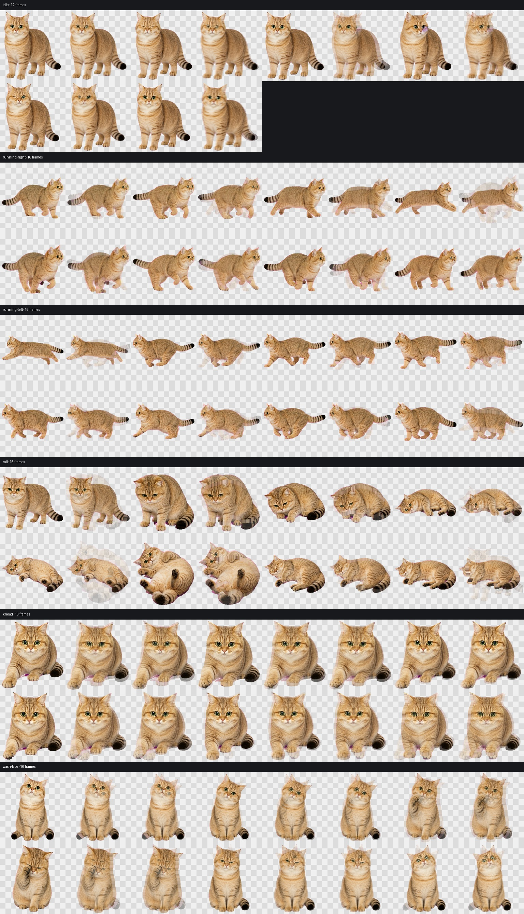

# 妙妙：金渐层交互桌宠

妙妙是基于项目内真实照片和动作视频制作的半写实金渐层桌宠。她保留圆脸、绿色圆眼、粉色鼻头、暖金底色与黑色毛尖、浅色下巴胸腹，以及蓬松环纹黑尾尖。



## 本次动画升级

- 待机“眨眼 + 往旁边看”扩展为 12 帧。
- 左右跑扩展为各 16 帧，并保持循环首尾和基线稳定。
- 撒娇打滚、踩奶、洗脸均扩展为 16 帧透明序列。
- 抚摸或 hover 时，以 1/2 概率随机播放“撒娇打滚”或“踩奶”。
- idle 默认保持轻微呼吸、眨眼和侧看；洗脸作为低频随机分支，每 35–65 秒最多触发一次。

扩展帧以现有妙妙图集为身份锚点，并结合项目里的“撒娇打滚”“踩奶”“躺着用爪子洗脸”视频动作设计。构建脚本不会重新设计妙妙，也不会改变单格 `192×208`、透明背景或整体尺寸。

## 启动交互桌宠（Windows）

双击：

```text
launch-miaomiao-desktop.cmd
```

交互方式：

- 鼠标移入或单击：随机打滚 / 踩奶
- 左右拖动：对应方向跑动
- 待机：普通待机，偶尔洗脸
- 右键：关闭

仅验证动作包而不打开窗口：

```powershell
.\launch-miaomiao-desktop.ps1 -CheckOnly
```

## 安装为 Codex v2 宠物

标准 Codex 宠物包仍位于 `pet/miaomiao/`：

```powershell
.\install.ps1
```

然后在 Codex 的“设置 → 宠物”中刷新并选择“妙妙”。

需要注意：Codex 26.715 的 v2 渲染器固定为 `8×11` 图集，并在客户端硬编码每个标准状态的帧数；hover 也固定映射到 `jumping`。`pet.json` 不支持随机事件或 idle 动作池。项目因此保留标准 Codex 包，同时用 `behavior.json` 和 Windows 交互启动器实现本次要求的高帧数及随机行为。详见 [动作与状态映射](docs/动作与状态映射.md)。

## 关键文件

```text
pet/miaomiao/
  pet.json              Codex v2 配置
  spritesheet.webp      1536×2288 标准透明图集
  behavior.json         交互事件与动作池
  actions/*/*.png       12–16 帧透明动作序列

previews/actions-v2/
  contact-sheet.jpg     新动作接触表
  *.gif                 动作循环预览

scripts/build_action_assets.py
                        从已验证图集重建高帧数动作资产

launch-miaomiao-desktop.*
                        Windows 透明置顶交互桌宠
```

原始视频保留在本地 `references/videos/`，仓库提交精选关键帧、构建脚本、最终动作与 QA 预览。
